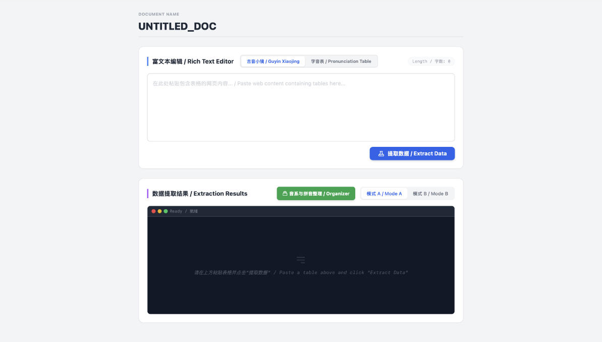
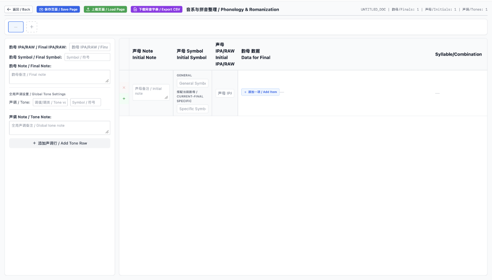
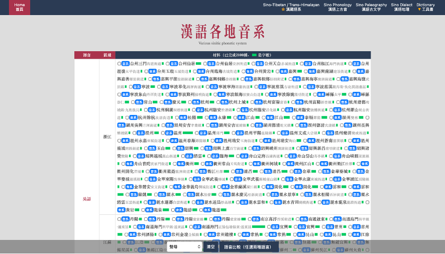
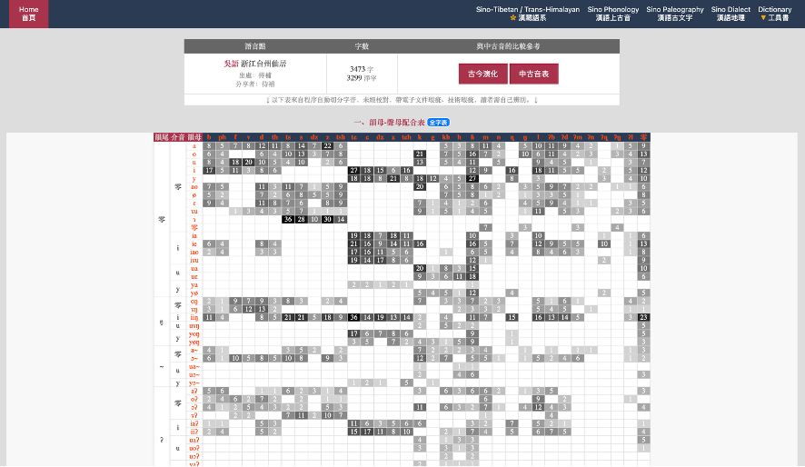
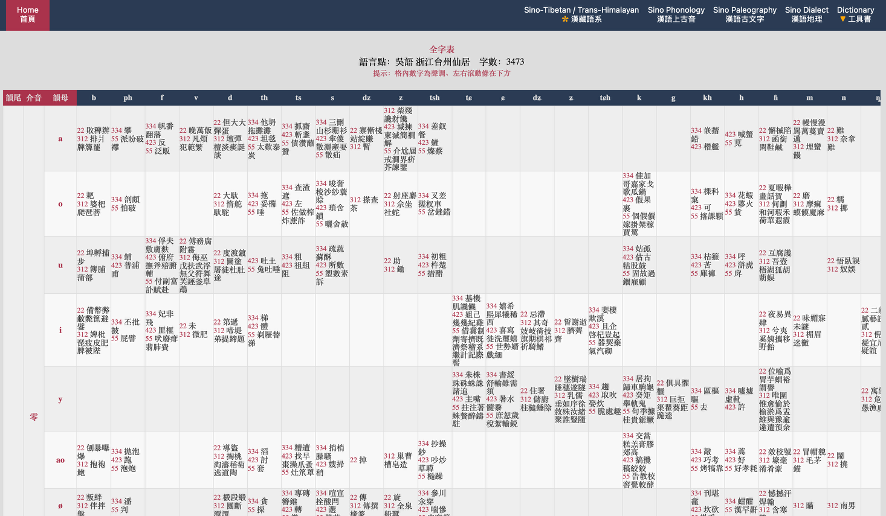
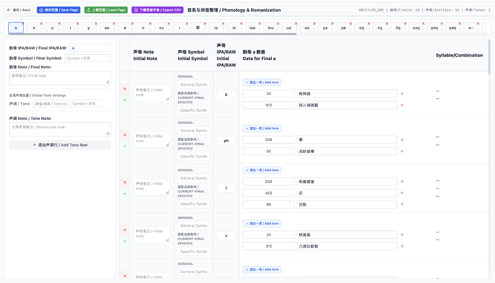
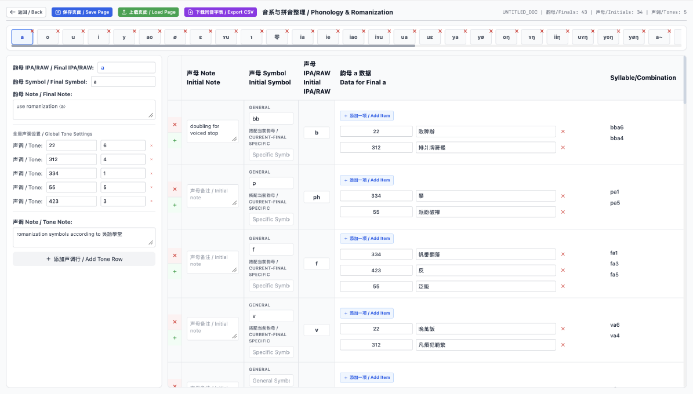
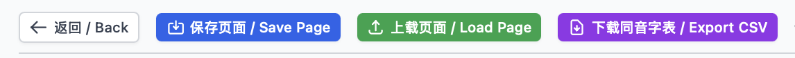

# 參與建設<br>Contributing

本生態系統高度歡迎社區成員為 **漢字文化圈（Sinosphere）及大陸東南亞語言聯盟（Mainland Southeast Asia linguistic area）** 中的各類語言與語言變體，以及更廣泛的其他語言，設計、整理並貢獻羅馬字方案（romanization schemes）及相關字音資源。我們希望通過統一、開放且可擴展的數據與工具基礎設施，使不同語言、方言及不同設計思路下的羅馬字方案能夠以一致的方式被記錄、共享、比較、擴展及重新使用。

本生態系統的核心基礎設施之一是 **PhonEngine**。PhonEngine 目前包含兩個相互配合的軟件工具：**PhonSymbol** 與 **PhonConvert**。它們主要面向羅馬字方案設計與字音資源製作過程中的幾個實際問題：如何將不同語言或方言的羅馬字方案以**統一的數據結構與文件格式**進行錄入、存儲和展示，使其同時具有人類可讀性（human-readable）與機器可讀性（machine-readable）；如何基於既定羅馬字方案快速建立大規模字音數據表；以及如何以統一格式保存字音表的製作狀態（editing state）和最終輸出結果。

與直接編寫 JSON、CSV 或其他結構化文件相比，PhonEngine 同時提供面向語言學工作流程設計的**可視化前端介面**，讓使用者可以在不直接操作底層數據結構的情況下完成羅馬字方案錄入、音系映射、字音數據轉換、editing state 保存及字音表導出。由 PhonEngine 產生的標準化文件亦構成本生態系統中羅馬字方案及字音資源交換、存儲與貢獻的主要數據格式。

為確保不同貢獻者提交的羅馬字方案具有一致的數據結構、可讀性及可擴展性，本生態系統強烈建議每一個羅馬字方案（scheme）均建立獨立的文件夾（scheme folder），並在其中保存由 PhonSymbol 導出的 JSON 文件作為該方案的 scheme file。

該 scheme file 應包含該羅馬字方案的完整映射關係及相關 note 數據，作為後續字音資源製作、轉換及其他工具鏈處理的標準化輸入。

We warmly welcome community members to design, organize, and contribute **romanization schemes** and related pronunciation resources for languages and language varieties across the **Sinosphere** and the **Mainland Southeast Asia linguistic area**, as well as for languages beyond these regions. Through a unified, open, and extensible data and tooling infrastructure, we aim to enable romanization schemes developed for different languages, varieties, and design traditions to be recorded, shared, compared, extended, and reused in a consistent manner.

One of the core infrastructure components of this ecosystem is **PhonEngine**. PhonEngine currently consists of two complementary software tools: **PhonSymbol** and **PhonConvert**. Together, they address several practical problems that arise when designing romanization schemes and constructing pronunciation resources: how to enter, store, and present romanization schemes for different languages and varieties using **standardized data structures and file formats**, while keeping them both human-readable and machine-readable; how to efficiently construct large-scale pronunciation tables based on a given romanization scheme; and how to preserve both the production state (**editing state**) and final outputs of pronunciation resources in standardized formats.

Rather than requiring users to manually edit JSON, CSV, or other structured files, PhonEngine provides **visual front-end interfaces designed around linguistic workflows**. These interfaces allow users to enter romanization schemes, define phonological mappings, convert pronunciation data, save editing states, and export pronunciation tables without directly manipulating the underlying data structures. Standardized files generated by PhonEngine also serve as the primary formats for exchanging, storing, and contributing romanization schemes and pronunciation resources within the ecosystem.

To ensure consistent data structures, readability, and extensibility across contributions, this ecosystem strongly recommends that each romanization scheme should be organized in an independent scheme folder, with the JSON file exported from PhonSymbol stored as the scheme file.

The scheme file should contain the complete mapping relationships and associated note information of the romanization scheme, serving as the standardized input for subsequent pronunciation-resource construction, conversion, and other processing workflows.

---

## PhonSymbol

### 基本錄入單元：Cell 與 symbol / note 欄位<br>Basic Entry Unit: Cells and the symbol / note Fields

每個格子的基本樣式如下圖所示 / The basic structure of each cell is shown below:


**PhonSymbol** 提供一個表格型態的前端介面，用於錄入羅馬字方案中的基本映射關係。使用者可以在每個格子（cell）中記錄一個**音位（phoneme）、或音素（phone）、或字素（grapheme）**，以及與其對應（mapping）的**羅馬字符號（romanization symbol）**。

其中：

* 在 **`symbol / 符号`** 欄中填入對應的**羅馬字符號（romanization symbol）**；
* 在 **`note / 备注`** 欄中填入該符號所對應的**音位（phoneme）、或音素（phone）、或字素（grapheme）**，並可加入其他所需的備注信息。

這種設計使 PhonSymbol 不限定使用者必須採用單一類型的語言學表示。根據不同語言、方言及羅馬字方案的設計需要，每個 mapping unit 可以是一個 phoneme、phone 或 grapheme，再與相應的 romanization symbol 建立對應關係。

**PhonSymbol** provides a table-based front-end interface for entering the basic mapping relationships that constitute a romanization scheme. In each cell, users can record a **phoneme, or a phone, or a grapheme**, together with its corresponding **romanization symbol**.

Within each cell:

* enter the corresponding **romanization symbol** in the **`symbol / 符号`** field;
* enter the associated **phoneme, or phone, or grapheme** in the **`note / 备注`** field, together with any other notes or annotations that may be needed.

This design does not require PhonSymbol users to adopt a single type of linguistic representation. Depending on the language, variety, and design principles of a particular romanization scheme, each mapping unit may represent a phoneme, a phone, or a grapheme, which is then mapped to the corresponding romanization symbol.

---

### PhonSymbol 整體介面與兩種錄入模式<br>PhonSymbol Interface and Two Entry Modes

PhonSymbol 的整體介面如下圖所示。介面提供兩種羅馬字方案錄入模式，可通過頁面頂部的 **「头腹尾 M-N-C / 韵母 Final」** 切換按鈕進行選擇。

The overall PhonSymbol interface is shown below. Two romanization-entry modes are provided and can be selected using the **"头腹尾 M-N-C / 韵母 Final"** mode switch located at the top of the interface.

| 頭腹尾 M-N-C 模式 | 韻母 Final 模式 |
|:---:|:---:|
|  |  |

---

#### 「頭腹尾 M-N-C」模式<br>M-N-C Mode

在 **「頭腹尾 M-N-C」模式** 下，羅馬字錄入部分由六個相互獨立的區域（area；亦即論文中所稱的 unit 或 editable grid）組成：

1. **聲母 / Initial (`sheng_mu`)**
2. **韻頭 / Medial (`yun_tou`)**
3. **韻腹 / Nucleus (`yun_fu`)**
4. **韻尾 / Coda (`yun_wei`)**
5. **成音節鼻音 / Syllabic Nasal (`cheng_yin_jie_bi_yin`)**
6. **聲調 / Tone (`sheng_diao`)**

其中，聲母（Initial）、韻頭（Medial）、韻腹（Nucleus）與韻尾（Coda）可以分別錄入相應語言或方言中各音系單位與其羅馬字符號之間的 mapping；成音節鼻音（Syllabic Nasal）區域用於記錄可獨立構成音節的鼻音及其羅馬字表示；聲調（Tone）區域則用於記錄聲調與相應羅馬字聲調符號或標記之間的 mapping。

每一個 area 均由一個或多個 cell 組成。使用者可以通過區域下方的 **「+ 添加一格 / Add cell」** 按鈕增加新的 cell。

當鼠標光標移至某一 cell 上方時，該 cell 的右上角會顯示 ❌ 按鈕，點擊即可刪除該 cell。為確保每個 area 始終保持可編輯狀態，**每個 area 至少保留一個 cell**；當某一 area 中僅剩一個 cell 時，該 cell 不可再被刪除。

在每個 cell 中，使用者按照前述格式，在 **`symbol / 符号`** 欄填入 romanization symbol，並在 **`note / 备注`** 欄填入其所對應的 phoneme、或 phone、或 grapheme，以及其他需要保存的備注信息。

In **M-N-C mode**, the romanization-entry interface consists of six independent areas (i.e., the units or editable grids referred to in the paper):

1. **Initial (`sheng_mu`)**
2. **Medial (`yun_tou`)**
3. **Nucleus (`yun_fu`)**
4. **Coda (`yun_wei`)**
5. **Syllabic Nasal (`cheng_yin_jie_bi_yin`)**
6. **Tone (`sheng_diao`)**

The Initial, Medial, Nucleus, and Coda areas allow users to separately record mappings between the corresponding phonological units of a language or variety and their romanization symbols. The Syllabic Nasal area is used for nasal segments that can independently constitute a syllable and their corresponding romanized representations. The Tone area records mappings between tones and their corresponding romanization symbols or tone markers.

Each area contains one or more cells. Additional cells can be created using the **“+ 添加一格 / Add cell”** button located below the corresponding area.

When the pointer is placed over a cell, a ❌ button appears in the upper-right corner of that cell and can be used to remove it. To ensure that every area remains editable, **each area must contain at least one cell**. When only one cell remains in an area, that cell cannot be deleted.

Within each cell, users enter the romanization symbol in the **`symbol / 符号`** field and enter the corresponding phoneme, or phone, or grapheme, together with any additional annotations, in the **`note / 备注`** field.


#### 「韻母 Final」模式<br>Final Mode

在 **「韻母 Final」模式** 下，PhonSymbol 不再將韻母內部進一步拆分為韻頭（Medial）、韻腹（Nucleus）及韻尾（Coda），而是將其作為一個完整的 **韻母（Final）** 單位進行錄入。

因此，該模式的羅馬字錄入部分由四個相互獨立的 area 組成：

1. **聲母 / Initial (`sheng_mu`)**
2. **韻母 / Final (`yun_mu`)**
3. **成音節鼻音 / Syllabic Nasal (`cheng_yin_jie_bi_yin`)**
4. **聲調 / Tone (`sheng_diao`)**

其中，聲母（Initial）區域用於錄入聲母與 romanization symbol 的 mapping；韻母（Final）區域則直接以完整韻母作為 mapping unit，而不要求使用者將其拆分為 Medial、Nucleus 與 Coda。成音節鼻音（Syllabic Nasal）及聲調（Tone）區域的功能與「頭腹尾 M-N-C」模式相同。

這一模式適合以完整韻母為主要分析或表示單位的語言、方言或羅馬字方案，使使用者可以根據具體方案的音系結構選擇較合適的錄入方式，而無需強制採用 M-N-C 的內部拆分。

與「頭腹尾 M-N-C」模式相同，每個 area 均可通過 **「+ 添加一格 / Add cell」** 增加新的 cell；將鼠標光標置於某一 cell 上方時，可使用右上角顯示的 ❌ 按鈕刪除該 cell。每個 area 同樣至少保留一個 cell，因此當區域內僅剩一個 cell 時，該 cell 不可被刪除。

每個 cell 的填寫方式亦完全相同：在 **`symbol / 符号`** 欄填入 romanization symbol，在 **`note / 备注`** 欄填入其所對應的 phoneme、或 phone、或 grapheme，以及其他所需的備注信息。

In **Final mode**, PhonSymbol does not further divide the final into separate Medial, Nucleus, and Coda components. Instead, the **Final** is treated as a complete mapping unit.

Accordingly, the romanization-entry interface in this mode consists of four independent areas:

1. **Initial (`sheng_mu`)**
2. **Final (`yun_mu`)**
3. **Syllabic Nasal (`cheng_yin_jie_bi_yin`)**
4. **Tone (`sheng_diao`)**

The Initial area is used to record mappings between initials and romanization symbols. The Final area treats an entire final as a single mapping unit and does not require it to be decomposed into Medial, Nucleus, and Coda components. The Syllabic Nasal and Tone areas function in the same way as their counterparts in M-N-C mode.

This mode is suitable for languages, varieties, or romanization schemes in which the complete final serves as the preferred unit of analysis or representation. It therefore allows users to select a representation structure appropriate to the phonological organization of a particular scheme without requiring an M-N-C decomposition.

As in M-N-C mode, additional cells can be created within each area using the **“+ 添加一格 / Add cell”** button. When the pointer is placed over a cell, a ❌ button appears in its upper-right corner and can be used to remove the cell. Each area must retain at least one cell, so the final remaining cell in an area cannot be deleted.

Cell contents are entered in exactly the same way as in M-N-C mode: the **`symbol / 符号`** field contains the romanization symbol, while the **`note / 备注`** field contains the corresponding phoneme, or phone, or grapheme, together with any other required annotations.

---

### JSON 數據<br>JSON Data

#### 數據預覽<br>Data Preview

PhonSymbol 介面下方的實時數據預覽區域如下圖所示 / The real-time data preview section at the bottom of the PhonSymbol interface is shown below:


在 PhonSymbol 介面（包括「頭腹尾 M-N-C」模式與「韻母 Final」模式）下方，設有 **「实时数据预览 / REAL-TIME DATA PREVIEW (JSON)」** 區域，用於即時展示當前羅馬字方案的結構化數據。每當使用者在各個 area 中新增、修改或刪除 cell 時，下方 JSON 內容會同步更新，反映當前方案的完整數據結構。

At the bottom of the PhonSymbol interface (in both M-N-C mode and Final mode), the **"实时数据预览 / REAL-TIME DATA PREVIEW (JSON)"** section displays the structured data representation of the current romanization scheme. Whenever users add, modify, or remove cells in any area, the JSON preview is updated simultaneously to reflect the current complete data structure of the scheme.

#### JSON 文件結構<br>JSON File Structure

PhonSymbol 使用 JSON（JavaScript Object Notation）作為羅馬字方案的標準化存儲格式。JSON 輕量、易於人類閱讀，同時方便機器解析。一個「頭腹尾 M-N-C」模式的方案 JSON 結構示例如下（`…` 表示省略的同類 cell）：

```json
{
  "scheme_name": "ExampleRomZJ1",
  "sheng_mu": [
    { "symbol": "b", "note": "/p/" },
    { "symbol": "p", "note": "/pʰ/" }
  ],
  "yun_tou": [ … ],
  "yun_fu": [ … ],
  "yun_wei": [ … ],
  "cheng_yin_jie_bi_yin": [ … ],
  "sheng_diao": [ … ]
}
```

在 PhonSymbol 生成的 JSON 中：

- **`scheme_name`** 用於保存當前羅馬字方案名稱；
- 每個錄入區域（area）均作為獨立的數據欄位（key）保存；
- 每個 area 對應一個列表（array），其中包含該區域內所有 cell 的數據；
- 每個 cell 以一個物件（object）的形式保存，包含：
  - **`symbol`**：該 mapping 對應的羅馬字符號；
  - **`note`**：該符號所對應的 phoneme、或 phone、或 grapheme，以及其他備注信息。

PhonSymbol 使用的 JSON 結構會根據所選擇的錄入模式而有所不同。

在「頭腹尾 M-N-C」模式下，JSON 中以下六個 area 作為獨立的數據欄位（key）保存：

- `sheng_mu`（聲母 / Initial）
- `yun_tou`（韻頭 / Medial）
- `yun_fu`（韻腹 / Nucleus）
- `yun_wei`（韻尾 / Coda）
- `cheng_yin_jie_bi_yin`（成音節鼻音 / Syllabic Nasal）
- `sheng_diao`（聲調 / Tone）

在此模式下，JSON 不包含 `yun_mu`（韻母 / Final）欄位，因為韻母已根據 M-N-C 結構拆分為 Medial、Nucleus 及 Coda 三個獨立部分。

在「韻母 Final」模式下，JSON 中以下四個 area 作為獨立的數據欄位（key）保存：

- `sheng_mu`（聲母 / Initial）
- `yun_mu`（韻母 / Final）
- `cheng_yin_jie_bi_yin`（成音節鼻音 / Syllabic Nasal）
- `sheng_diao`（聲調 / Tone）

在此模式下，JSON 不包含 `yun_tou`（韻頭 / Medial）、`yun_fu`（韻腹 / Nucleus）及 `yun_wei`（韻尾 / Coda）欄位，因為完整韻母作為單一 mapping unit 進行錄入。

因此，PhonSymbol 生成的 JSON 文件既能保存不同語言或方言羅馬字方案的具體 mapping 關係，也能通過不同數據結構反映不同音系分析方式。

PhonSymbol uses JSON (JavaScript Object Notation) as the standardized storage format for romanization schemes. JSON is lightweight, human-readable, and easy for machines to parse. The following example illustrates the structure of a scheme JSON in M-N-C mode (`…` indicates omitted cells of the same kind):

```json
{
  "scheme_name": "ExampleRomZJ1",
  "sheng_mu": [
    { "symbol": "b", "note": "/p/" },
    { "symbol": "p", "note": "/pʰ/" }
  ],
  "yun_tou": [ … ],
  "yun_fu": [ … ],
  "yun_wei": [ … ],
  "cheng_yin_jie_bi_yin": [ … ],
  "sheng_diao": [ … ]
}
```

In the JSON generated by PhonSymbol:

- **`scheme_name`** stores the name of the current romanization scheme;
- each entry area is stored as an independent data field (key);
- each area corresponds to a list (array) containing all cells within that area;
- each cell is represented as an object containing:
  - **`symbol`**: the romanization symbol assigned to the mapping unit;
  - **`note`**: the corresponding phoneme, or phone, or grapheme, together with additional annotations.

The JSON structure generated by PhonSymbol differs depending on the selected entry mode.

In M-N-C mode, the following six areas are stored as independent data fields (keys) in the JSON:

- `sheng_mu` (Initial)
- `yun_tou` (Medial)
- `yun_fu` (Nucleus)
- `yun_wei` (Coda)
- `cheng_yin_jie_bi_yin` (Syllabic Nasal)
- `sheng_diao` (Tone)

In this mode, the JSON does not contain the `yun_mu` (Final) field, because the final is decomposed into three independent components: Medial, Nucleus, and Coda.

In Final mode, the following four areas are stored as independent data fields (keys) in the JSON:

- `sheng_mu` (Initial)
- `yun_mu` (Final)
- `cheng_yin_jie_bi_yin` (Syllabic Nasal)
- `sheng_diao` (Tone)

In this mode, the JSON does not contain the `yun_tou` (Medial), `yun_fu` (Nucleus), or `yun_wei` (Coda) fields, because the complete final is treated as a single mapping unit.

The JSON files generated by PhonSymbol therefore not only preserve the specific mapping relationships of different romanization schemes, but also represent different approaches to phonological analysis through flexible data structures.

#### JSON 導入與導出<br>JSON Import and Export

在 PhonSymbol 主介面右上方，設有 **「导入 JSON / Import」** 與 **「导出 JSON / Export」** 按鈕，用於保存、共享及恢復羅馬字方案數據。

點擊 **「导出 JSON / Export」** 按鈕後，PhonSymbol 會將當前實時數據預覽區域中的完整 JSON 數據導出為 JSON 文件。導出的文件名稱由 JSON 中的 `scheme_name` 欄位自動生成，從而使不同羅馬字方案能夠以其方案名稱進行保存與管理。

點擊 **「导入 JSON / Import」** 按鈕後，使用者可以導入符合 PhonSymbol JSON 格式規範的 JSON 文件。導入後，PhonSymbol 會根據 JSON 文件中保存的 `scheme_name`、各 area 的數據欄位（key），以及各 cell 中的 `symbol` 與 `note` 信息，恢復界面中的 Scheme Name 以及各區域（area）與 cell 的內容，使使用者可以繼續編輯已保存的羅馬字方案。

The upper-right corner of the PhonSymbol interface provides **"导入 JSON / Import"** and **"导出 JSON / Export"** buttons for saving, sharing, and restoring romanization scheme data.

By clicking **"导出 JSON / Export"**, PhonSymbol exports the complete JSON data currently displayed in the real-time data preview section as a JSON file. The exported file name is automatically generated from the `scheme_name` field stored in the JSON structure, allowing different romanization schemes to be saved and managed using their scheme names.

By clicking **"导入 JSON / Import"**, users can import JSON files that conform to the PhonSymbol JSON format specification. After importing, PhonSymbol restores the Scheme Name and the contents of all areas and cells according to the `scheme_name`, the area-level data fields (keys), and the `symbol` and `note` values stored in the JSON file, allowing users to continue editing previously saved romanization schemes.

---

### Scheme File 與目錄結構<br>Scheme File and Directory Structure

PhonSymbol 導出的 JSON 文件是本生態系統中保存羅馬字方案定義的標準 scheme file。對於每一個羅馬字方案（scheme），貢獻者應建立一個獨立的文件夾，並將對應的 PhonSymbol JSON 文件保存在該文件夾中。

The JSON file exported by PhonSymbol serves as the standard scheme file for storing romanization scheme definitions within this ecosystem. For each romanization scheme, contributors should create an independent folder and store the corresponding PhonSymbol-exported JSON file inside that folder.

推薦的目錄結構如下 / The recommended directory structure is as follows:

```text
SchemeName/
├── SchemeName.json
├── README.md
└── other resources
```

其中：

- `SchemeName.json` 為由 PhonSymbol 導出的 scheme file；
- `README.md` 可用於介紹該方案的設計原則、適用語言、音系分析及其他相關信息；
- 其他與該方案相關的資源（如字音表、轉換數據或測試文件）可根據需要保存在同一文件夾內。

貢獻者不應手動創建與 PhonSymbol schema 不兼容的 scheme JSON 文件。所有正式提交的 scheme file 均應優先通過 PhonSymbol 建立並導出。

Where:

- `SchemeName.json` is the scheme file exported from PhonSymbol;
- `README.md` can describe the design principles, target language or variety, phonological analysis, and related information of the scheme;
- other scheme-related resources (such as pronunciation tables, conversion data, or test files) may be stored in the same folder when needed.

Contributors should not manually create scheme JSON files incompatible with the PhonSymbol schema. Officially contributed scheme files should preferably be created and exported through PhonSymbol.


---

## PhonConvert

### 兩個介面<br>Two Pages

**PhonConvert** 是將現有字音數據資源與羅馬字方案相結合，快速製作羅馬字字音數據的工具。與 PhonSymbol 一樣，PhonConvert 也是一個瀏覽器前端工具。

PhonConvert 包含兩個介面：一個是打開工具後默認進入的介面（下文稱為 **the first page**）；另一個是在 the first page 點擊 **「音系与拼音整理 / Organizer」** 按鈕後進入的 **「音系与拼音整理 / Phonology & Romanization」organizer**（即論文中所稱的 phonology-and-romanization organizer，下文統一簡稱為 **organizer**）。

**PhonConvert** is a tool that combines existing pronunciation-data resources with a romanization scheme to efficiently produce romanized pronunciation data. Like PhonSymbol, PhonConvert is a browser-based front-end tool.

PhonConvert consists of two pages. The first is the page shown by default when the tool is opened (referred to below as **the first page**). The second is the **"音系与拼音整理 / Phonology & Romanization" organizer**, entered by clicking the **"音系与拼音整理 / Organizer"** button on the first page. This organizer is the phonology-and-romanization organizer referred to in the paper, and is hereafter simply called the **organizer**.

The first page 如下圖所示 / The first page is shown below:



Organizer 如下圖所示 / The organizer is shown below:



---

### 原始數據輸入：富文本編輯與兩種模式<br>Data Input: The Rich Text Editor and Two Modes

The first page 中的 **「富文本编辑 / Rich Text Editor」** 是接受原始字音數據的區域。這個區域可以接受兩種形式的原始數據，分別對應 **「古音小镜 / Guyin Xiaojing」—「字音表 / Pronunciation Table」** 模式切換按鈕可切換的兩種模式：

- 在 **「古音小镜 / Guyin Xiaojing」模式** 下，可直接接受來自古音小镜（Kaom.net）網站的數據，具體操作步驟將在下文詳細介紹；
- 在 **「字音表 / Pronunciation Table」模式** 下，可接受每行為 `汉字,声母,韵母,声调` 形式的數據（其中的逗號必須為英文半角逗號 `,`），例如 `間,tɕ,iæn,陰平55`，下一行也是如此。

在「字音表 / Pronunciation Table」模式的數據中，**聲母一列可以留空**（表示零聲母），而**漢字、韻母、聲調三列必須有值**；不符合要求的行將在提取時被跳過。

The **"富文本编辑 / Rich Text Editor"** area on the first page is where raw pronunciation data is entered. It accepts two forms of raw data, corresponding to the two modes available on the **"古音小镜 / Guyin Xiaojing" — "字音表 / Pronunciation Table"** mode switch:

- In **"古音小镜 / Guyin Xiaojing" mode**, data from the Guyin Xiaojing website (Kaom.net) can be accepted directly; the detailed steps are described in a later section;
- In **"字音表 / Pronunciation Table" mode**, the data should contain one entry per line in the form `汉字,声母,韵母,声调` (the commas must be half-width ASCII commas `,`), for example `間,tɕ,iæn,陰平55`, and so on for the following lines.

In "字音表 / Pronunciation Table" mode data, **the initial field may be left empty** (indicating a zero initial), while **the character, final, and tone fields are required**; lines that do not meet these requirements will be skipped during extraction.

---

### 使用古音小镜（Kaom.net）數據的操作步驟<br>Steps for Using Data from Guyin Xiaojing (Kaom.net)

**步驟 1：打開索引頁並選擇語言地點 / Step 1: Open the index page and select a language location**

打開古音小镜 Kaom.net 的漢語族語言字音索引頁（ **http://www.kaom.net/si_x.php** ），並選擇一個目標語言地點。

Open the Kaom.net Sinitic-language pronunciation index at **http://www.kaom.net/si_x.php** and select a target language location.

索引頁如下圖所示 / The index page is shown below:



**步驟 2：打開音系頁面與全字表 / Step 2: Open the phonology page and the full character table**

在所選語言地點的條目中點擊 **「音系」** 按鈕，打開該地點的音系頁面；再在音系頁面中點擊 **「全字表」**，打開字級字音表。

For the selected location, click the **"音系"** (phonology) button to open its phonology page; from the phonology page, click **"全字表"** (full character table) to open the character-level pronunciation table.

音系頁面如下圖所示 / The phonology page is shown below:



全字表頁面如下圖所示 / The full character table page is shown below:



**步驟 3：複製全字表內容並粘貼至 PhonConvert / Step 3: Copy the full character table and paste it into PhonConvert**

在全字表頁面中全選頁面內容（Windows / Linux 按 **Ctrl+A**,macOS 按 **Command+A**)，複製後粘貼到 PhonConvert the first page 的 **「富文本编辑 / Rich Text Editor」** 中。

On the full character-pronunciation table page, select all page content (**Ctrl+A** on Windows / Linux or **Command+A** on macOS), copy it, and paste it into the **"富文本编辑 / Rich Text Editor"** on the first page of PhonConvert.

---

### 數據提取與進入 Organizer<br>Data Extraction and Entering the Organizer

無論 **「富文本编辑 / Rich Text Editor」** 接受的是 **「古音小镜 / Guyin Xiaojing」** 還是 **「字音表 / Pronunciation Table」** 模式的數據，點擊 **「提取数据 / Extract Data」** 後，兩種來源的數據都會被提取為相同的內部格式，匯入同一條數據流程。提取完成後，再點擊 **「音系与拼音整理 / Organizer」**，即可進入 organizer；此時 organizer 中已包含從原始字音數據提取解析出的數據。

Regardless of whether the **"富文本编辑 / Rich Text Editor"** receives data in **"古音小镜 / Guyin Xiaojing"** mode or **"字音表 / Pronunciation Table"** mode, clicking **"提取数据 / Extract Data"** extracts the data from either source into the same internal format and funnels it into the same processing pipeline. After extraction is complete, clicking **"音系与拼音整理 / Organizer"** enters the organizer, which by then contains the data parsed from the raw pronunciation source.

載入提取數據後的 organizer 如下圖所示 / The organizer loaded with the extracted data is shown below:



---

### Organizer 介面<br>The Organizer Interface

Organizer 介面頂端的橫向滾動條中，每個 tab 顯示一個韻母，即從原始數據中直接提取解析得到的韻母。

在介面左側 panel 的 **「韵母 IPA/RAW / Final IPA/RAW」** 輸入框中，可輸入或修改當前韻母；頂部橫向滾動條中當前 tab 顯示的韻母會隨之同步改變。在介面左側 panel 的 **「韵母 Symbol / Final Symbol」** 輸入框中，可輸入此韻母所 mapping 到的羅馬字表示；在其下方的 **「韵母 Note / Final Note」** 中，可輸入任何關於此韻母及其羅馬字的備注信息。

主表中的 **「声母 IPA/RAW / Initial IPA/RAW」** 一列列出了所有從原始字音數據提取解析出的聲母——不論某個聲母能否與當前 tab 所選韻母組成合法音節。因此，無論選擇哪一個韻母 tab，這一列的內容都不會改變。這一列中的每個聲母數據均可由使用者自行修改，以便修復原始數據中可能存在的錯誤信息。

在「声母 IPA/RAW / Initial IPA/RAW」左側的 **「声母 Symbol / Initial Symbol」** 一列中，可填入每個聲母所 mapping 到的羅馬字符號。其中，**GENERAL** 輸入框中的內容在任何韻母 tab 下都保持相同，而 **「搭配当前韵母 / CURRENT-FINAL SPECIFIC」** 輸入框中的內容僅在當前所選韻母 tab 下存在和生效。

在「声母 Symbol / Initial Symbol」再左側的 **「声母 Note / Initial Note」** 一列中，可填入關於每個聲母及其羅馬字的任何備注信息。

在 **「声母 IPA/RAW / Initial IPA/RAW」** 列右側的 **「韵母 数据 / Data for Final」** 一列中，列出了每個聲母與當前所選 tab 韻母形成的「聲母＋韻母」組合下，字音表中實際存在的音節的聲調，以及每個「聲母＋韻母＋聲調」（聲韻調）組合所對應的漢字（這些聲調與漢字信息均從原始字音數據中提取解析而來）。所有聲調信息及其漢字信息均在可編輯框內，使用者可自行編輯；也可點擊 **「+ 添加一项 / Add Item」** 按鈕，在該「聲母＋韻母」組合下添加更多聲調及其對應的漢字，以補充原始字音數據中可能缺失的數據。

從原始數據提取解析出的聲調及其所 mapping 到的羅馬字符號，在 organizer 介面左側 panel 下方的 **「全局声调设置 / Global Tone Settings」** 區域填寫。使用者需要將「韵母 数据 / Data for Final」一列中列出的聲調數據，填入 **「声调 / Tone:」** 行左側的 **「调值/调类 / Tone value/category」** 輸入框，並在其右側的 **「Symbol / 符号」** 輸入框中填入此聲調所 mapping 到的羅馬字符號。如需添加新的聲調及其 mapping，可點擊下方的 **「+ 添加声调行 / Add Tone Row」** 按鈕。完成以上操作，才能在工具底層建立完整的聲調數據 mapping，從而生成正確的羅馬字拼寫。

在正確位置填入聲母、韻母所 mapping 到的羅馬字符號，並填寫好從原始數據提取解析的聲調數據及其 mapping 到的聲調羅馬字符號後，主表最右側的 **Syllable/Combination** 一列便會顯示每個音節的羅馬字拼寫，如下圖所示。聲調的羅馬字符號標在聲母與韻母之後，這一位置目前無法更改。



**「全局声调设置 / Global Tone Settings」** 設置的是當前語言／方言的全部聲調，不受所選韻母 tab 的影響。此區域下方的 **「声调 Note / Tone Note:」** 區域可供使用者填寫任何關於聲調及其 mapping 信息的備注；此輸入框針對整體所有聲調，每個聲調沒有自己獨立的備注填寫區域。

**「声母 Symbol / Initial Symbol」** 列中的 **「搭配当前韵母 / CURRENT-FINAL SPECIFIC」** 輸入框，主要是為漢語拼音中 `ying`、`yan`、`wen`、`wu` 這類音節的拼寫生成而準備的。例如，當前所選韻母 tab 對應的羅馬字是 `ing` 或 `u` 時，零聲母搭配這兩個韻母需要寫成 `y` 或 `w`，而搭配其他韻母時不這樣寫；此時便可在韻母羅馬字為 `ing` 或 `u` 的 tab 下，在零聲母所在行的「搭配当前韵母 / CURRENT-FINAL SPECIFIC」輸入框中填寫 `y` 或 `w`，即可生成 `ying`、`wu` 這樣的音節拼寫，而其他韻母下的零聲母音節不含 `y` 或 `w`。

對於要生成 `yan`、`wen` 這類拼寫的情況：若韻母 tab 對應的羅馬字是 `ian` 或 `uen`，僅在韻母之前加上聲母羅馬字是無法生成 `yan` 或 `wen` 的。為此，「搭配当前韵母 / CURRENT-FINAL SPECIFIC」輸入框專門支持一條 **`-A+B` 替換規則**：當輸入內容為 `-A+B` 的形式，且 `A` 是當前韻母羅馬字的第一個字符時，韻母羅馬字的第一個字符會被刪去並由 `B` 替代。因此，當韻母羅馬字為 `ian` 或 `uen` 時，輸入 `-i+y` 或 `-u+w`，即可生成 `yan` 或 `wen`。

In the horizontal scroll bar at the top of the organizer interface, each tab displays one final, i.e., a final directly extracted and parsed from the raw data.

In the **"韵母 IPA/RAW / Final IPA/RAW"** field on the left panel, the current final can be entered or modified; the final shown in the current tab of the top horizontal scroll bar updates accordingly. In the **"韵母 Symbol / Final Symbol"** field on the left panel, the romanized representation to which this final is mapped can be entered; and in the **"韵母 Note / Final Note"** field below it, any notes concerning this final and its romanization can be recorded.

The **"声母 IPA/RAW / Initial IPA/RAW"** column in the main table lists all initials extracted and parsed from the raw pronunciation data, regardless of whether a given initial can form a legal syllable with the final selected in the current tab. The contents of this column therefore remain unchanged no matter which final tab is selected. Every initial in this column can be edited by the user, allowing possible errors in the raw data to be corrected.

In the **"声母 Symbol / Initial Symbol"** column to the left of "声母 IPA/RAW / Initial IPA/RAW", the romanized symbol to which each initial is mapped can be entered. The contents of the **GENERAL** field remain the same under any final tab, whereas the contents of the **"搭配当前韵母 / CURRENT-FINAL SPECIFIC"** field exist and take effect only under the currently selected final tab.

In the **"声母 Note / Initial Note"** column further to the left, any notes concerning each initial and its romanization can be recorded.

In the **"韵母 数据 / Data for Final"** column to the right of **"声母 IPA/RAW / Initial IPA/RAW"**, the tones of the syllables that actually exist in the pronunciation data are listed for each combination of an initial with the final selected in the current tab, together with the Chinese characters corresponding to each initial–final–tone combination (these tones and characters are extracted and parsed from the raw pronunciation data). All tone information and the associated characters are contained in editable fields and can be modified by the user. The **"+ 添加一项 / Add Item"** button can be used to add further tones and their associated characters under a given initial–final combination, supplementing data that may be missing from the raw pronunciation source.

The tones extracted and parsed from the raw data, together with the romanized symbols to which they are mapped, are entered in the **"全局声调设置 / Global Tone Settings"** area at the bottom of the organizer's left panel. For each tone listed in the "韵母 数据 / Data for Final" column, the user enters the raw tone value into the **"调值/调类 / Tone value/category"** field on the left side of a **"声调 / Tone:"** row, and enters the romanized symbol to which that tone is mapped in the **"Symbol / 符号"** field to its right. To add further tones and their mappings, click the **"+ 添加声调行 / Add Tone Row"** button below. Only after these steps are completed is the underlying tone mapping fully established, allowing correct romanized spellings to be generated.

Once the romanized symbols for the initials and finals have been entered in the appropriate fields, and the tones extracted from the raw data together with their mapped romanized tone symbols have been filled in, the **Syllable/Combination** column on the far right of the main table displays the romanized spelling of each syllable, as shown above. The romanized tone symbol is placed after the initial and final; this position currently cannot be changed.

The **"全局声调设置 / Global Tone Settings"** area defines all tones of the current language or variety and is not affected by the selected final tab. The **"声调 Note / Tone Note:"** field below this area can be used to record any notes concerning the tones and their mappings; this field applies to the tones as a whole, and no separate note field is provided for each individual tone.

The **"搭配当前韵母 / CURRENT-FINAL SPECIFIC"** field in the **"声母 Symbol / Initial Symbol"** column is designed primarily for generating the spellings of syllables such as `ying`, `yan`, `wen`, and `wu` in Hanyu Pinyin. For example, when the romanization of the currently selected final tab is `ing` or `u`, a zero initial combining with these two finals needs to be written as `y` or `w`, whereas it is not written this way with other finals. In this case, under the final tab whose romanization is `ing` or `u`, entering `y` or `w` in the "搭配当前韵母 / CURRENT-FINAL SPECIFIC" field of the zero-initial row generates syllable spellings such as `ying` and `wu`, while zero-initial syllables under other finals remain without `y` or `w`.

For cases where spellings such as `yan` or `wen` are to be generated: if the romanization of the final tab is `ian` or `uen`, these spellings cannot be produced merely by prepending an initial symbol to the final. For this purpose, the "搭配当前韵母 / CURRENT-FINAL SPECIFIC" field specifically supports a **`-A+B` replacement rule**: when the input takes the form `-A+B` and `A` is the first character of the current final's romanization, the first character of the final's romanization is deleted and replaced by `B`. Therefore, when the final's romanization is `ian` or `uen`, entering `-i+y` or `-u+w` generates `yan` or `wen` respectively.

---

### 保存、恢復與導出<br>Saving, Restoring, and Exporting

在 organizer 介面左上角，設有如下圖所示的四個按鍵：

In the upper-left corner of the organizer interface, there are four buttons as shown below:



點擊 **「返回 / Back」** 可回到 the first page。回到 the first page 後，雖然該介面是空白的，但只要不刷新頁面，即使再次點擊 **「提取数据 / Extract Data」**，在點擊 **「音系与拼音整理 / Organizer」** 回到 organizer 後，organizer 中的數據依然保持與點擊「返回 / Back」之前相同。

點擊 **「保存页面 / Save Page」**，會下載一個保存當前 organizer 編輯狀態（editing state）的 JSON 文件。該文件保存了當前介面的所有數據，並自動命名為 `DOCUMENT NAME_当前时间.json`。點擊 **「上载页面 / Load Page」**，選擇上傳一個已保存的 editing state JSON 文件，即可在 organizer 介面恢復保存該文件時介面的所有數據。

點擊 **「下载同音字表 / Export CSV」**，會下載一個命名為 `DOCUMENT NAME_同音字表_当前时间.csv` 的文件。導出的 CSV 文件示例格式如下：

```text
Syllable/Combination,汉字
bba6,敗稗辦
bba4,排爿牌簰罷
pa1,攀
…
```

其中，第一行為表頭 `Syllable/Combination,汉字`；其後每行以英文半角逗號分隔前後兩部分：前一部分為羅馬字拼寫的音節，後一部分為此音節對應的漢字，多個漢字之間無空格、直接相連。

對於一個羅馬字方案，在其方案文件夾下，字音數據不是必須提交的，而是可選的。但如果提交字音數據，本生態系統強烈建議上傳一份與 PhonConvert 下載的同音字表格式相同的字表數據文件（可不由 PhonConvert 生成，但格式強烈建議保持統一）；如果這份字表數據文件是由 PhonConvert 生成的，也強烈建議將下載字表時最終版本的 editing state JSON 一併上傳。

By clicking **"返回 / Back"**, the user returns to the first page. Although the first page is then blank, as long as the page is not refreshed, the data in the organizer remains the same as before clicking "返回 / Back", even if **"提取数据 / Extract Data"** is clicked again before re-entering the organizer via **"音系与拼音整理 / Organizer"**.

By clicking **"保存页面 / Save Page"**, a JSON file storing the current editing state of the organizer is downloaded. This file preserves all data of the current interface and is automatically named `DOCUMENT NAME_当前时间.json`. By clicking **"上载页面 / Load Page"** and uploading a previously saved editing-state JSON file, all data of the interface at the time the file was saved is restored in the organizer.

By clicking **"下载同音字表 / Export CSV"**, a file named `DOCUMENT NAME_同音字表_当前时间.csv` is downloaded, in the format exemplified above. The first line is the header `Syllable/Combination,汉字`. Each following line contains two parts separated by a half-width comma: the first part is a syllable spelled in romanization, and the second part is the Chinese characters corresponding to that syllable, with multiple characters written consecutively without spaces.

For a romanization scheme, pronunciation data is optional rather than required in its scheme folder. However, if pronunciation data is submitted, this ecosystem strongly recommends uploading a pronunciation-table file in the same format as the homophone-character table downloaded from PhonConvert (the file does not have to be generated by PhonConvert, but the format should preferably remain consistent). If the pronunciation-table file is generated by PhonConvert, it is also strongly recommended that the final version of the editing-state JSON used when exporting the table be uploaded together with it.
