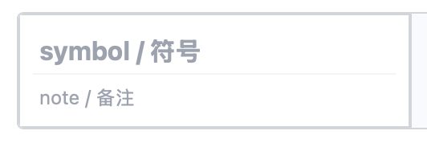
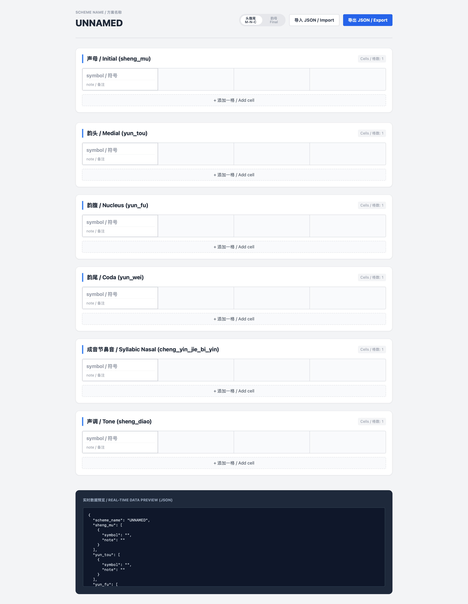
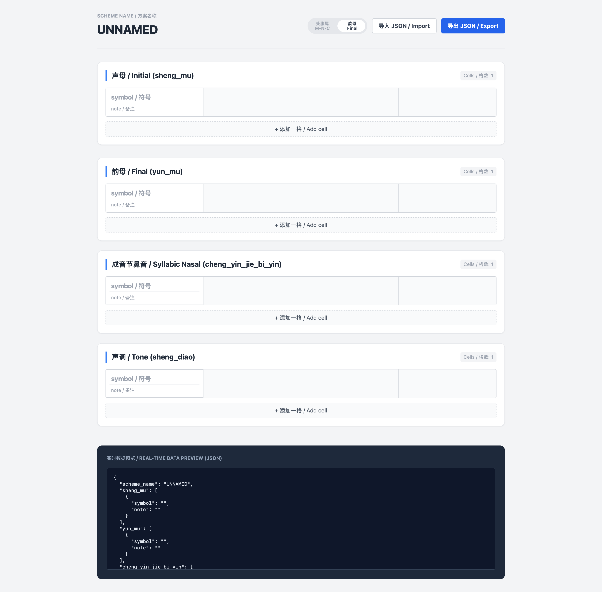
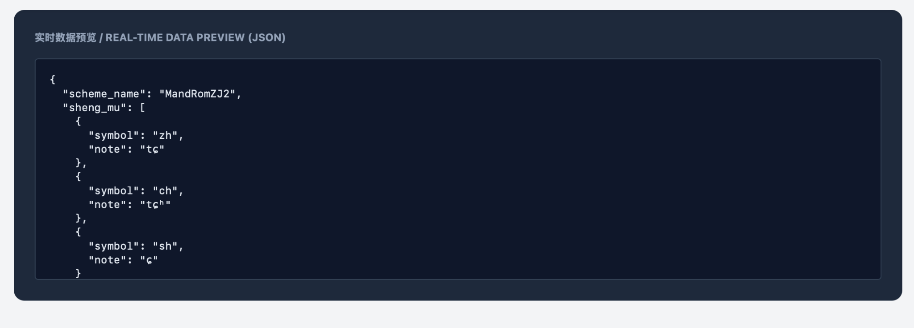

# 參與建設

# Contributing

本生態系統高度歡迎社區成員為 **漢字文化圈（Sinosphere）及大陸東南亞語言聯盟（Mainland Southeast Asia linguistic area）** 中的各類語言與語言變體，以及更廣泛的其他語言，設計、整理並貢獻羅馬字方案（romanization schemes）及相關字音資源。我們希望通過統一、開放且可擴展的數據與工具基礎設施，使不同語言、方言及不同設計思路下的羅馬字方案能夠以一致的方式被記錄、共享、比較、擴展及重新使用。

We warmly welcome community members to design, organize, and contribute **romanization schemes** and related pronunciation resources for languages and language varieties across the **Sinosphere** and the **Mainland Southeast Asia linguistic area**, as well as for languages beyond these regions. Through a unified, open, and extensible data and tooling infrastructure, we aim to enable romanization schemes developed for different languages, varieties, and design traditions to be recorded, shared, compared, extended, and reused in a consistent manner.

本生態系統的核心基礎設施之一是 **PhonEngine**。PhonEngine 目前包含兩個相互配合的軟件工具：**PhonSymbol** 與 **PhonConvert**。它們主要面向羅馬字方案設計與字音資源製作過程中的幾個實際問題：如何將不同語言或方言的羅馬字方案以**統一的數據結構與文件格式**進行錄入、存儲和展示，使其同時具有人類可讀性（human-readable）與機器可讀性（machine-readable）；如何基於既定羅馬字方案快速建立大規模字音數據表；以及如何以統一格式保存字音表的製作狀態（editing state）和最終輸出結果。

One of the core infrastructure components of this ecosystem is **PhonEngine**. PhonEngine currently consists of two complementary software tools: **PhonSymbol** and **PhonConvert**. Together, they address several practical problems that arise when designing romanization schemes and constructing pronunciation resources: how to enter, store, and present romanization schemes for different languages and varieties using **standardized data structures and file formats**, while keeping them both human-readable and machine-readable; how to efficiently construct large-scale pronunciation tables based on a given romanization scheme; and how to preserve both the production state (**editing state**) and final outputs of pronunciation resources in standardized formats.

與直接編寫 JSON、CSV 或其他結構化文件相比，PhonEngine 同時提供面向語言學工作流程設計的**可視化前端介面**，讓使用者可以在不直接操作底層數據結構的情況下完成羅馬字方案錄入、音系映射、字音數據轉換、editing state 保存及字音表導出。由 PhonEngine 產生的標準化文件亦構成本生態系統中羅馬字方案及字音資源交換、存儲與貢獻的主要數據格式。

Rather than requiring users to manually edit JSON, CSV, or other structured files, PhonEngine provides **visual front-end interfaces designed around linguistic workflows**. These interfaces allow users to enter romanization schemes, define phonological mappings, convert pronunciation data, save editing states, and export pronunciation tables without directly manipulating the underlying data structures. Standardized files generated by PhonEngine also serve as the primary formats for exchanging, storing, and contributing romanization schemes and pronunciation resources within the ecosystem.

為確保不同貢獻者提交的羅馬字方案具有一致的數據結構、可讀性及可擴展性，本生態系統強烈建議每一個羅馬字方案（scheme）均建立獨立的文件夾（scheme folder），並在其中保存由 PhonSymbol 導出的 JSON 文件作為該方案的 scheme file。

該 scheme file 應包含該羅馬字方案的完整映射關係及相關 note 數據，作為後續字音資源製作、轉換及其他工具鏈處理的標準化輸入。

To ensure consistent data structures, readability, and extensibility across contributions, this ecosystem strongly recommends that each romanization scheme should be organized in an independent scheme folder, with the JSON file exported from PhonSymbol stored as the scheme file.

The scheme file should contain the complete mapping relationships and associated note information of the romanization scheme, serving as the standardized input for subsequent pronunciation-resource construction, conversion, and other processing workflows.


## PhonSymbol

### PhonSymbol：羅馬字方案錄入與結構化存儲

**PhonSymbol** 提供一個表格型態的前端介面，用於錄入羅馬字方案中的基本映射關係。使用者可以在每個格子（cell）中記錄一個**音位（phoneme）、或音素（phone）、或字素（grapheme）**，以及與其對應（mapping）的**羅馬字符號（romanization symbol）**。

每個格子的基本樣式如下圖所示：



其中：

* 在 **`symbol / 符號`** 欄中填入對應的**羅馬字符號（romanization symbol）**；
* 在 **`note / 備注`** 欄中填入該符號所對應的**音位（phoneme）、或音素（phone）、或字素（grapheme）**，並可加入其他所需的備注信息。

這種設計使 PhonSymbol 不限定使用者必須採用單一類型的語言學表示。根據不同語言、方言及羅馬字方案的設計需要，每個 mapping unit 可以是一個 phoneme、phone 或 grapheme，再與相應的 romanization symbol 建立對應關係。

### PhonSymbol: Romanization-Scheme Entry and Structured Storage

**PhonSymbol** provides a table-based front-end interface for entering the basic mapping relationships that constitute a romanization scheme. In each cell, users can record a **phoneme, or a phone, or a grapheme**, together with its corresponding **romanization symbol**.

The basic structure of each cell is shown below:


Within each cell:

* enter the corresponding **romanization symbol** in the **`symbol / 符號`** field;
* enter the associated **phoneme, or phone, or grapheme** in the **`note / 備注`** field, together with any other notes or annotations that may be needed.

This design does not require PhonSymbol users to adopt a single type of linguistic representation. Depending on the language, variety, and design principles of a particular romanization scheme, each mapping unit may represent a phoneme, a phone, or a grapheme, which is then mapped to the corresponding romanization symbol.


### PhonSymbol 整體介面與兩種錄入模式

### PhonSymbol Interface and Two Entry Modes

PhonSymbol 的整體介面如下圖所示。介面提供兩種羅馬字方案錄入模式，可通過頁面頂部的 **「頭腹尾 M-N-C / 韻母 Final」**切換按鈕進行選擇。

The overall PhonSymbol interface is shown below. Two romanization-entry modes are provided and can be selected using the **“M-N-C / Final”** mode switch located at the top of the interface.





---

#### 「頭腹尾 M-N-C」模式

#### M-N-C Mode

在**「頭腹尾 M-N-C」模式**下，羅馬字錄入部分由六個相互獨立的區域（area；亦即論文中所稱的 unit 或 editable grid）組成：

1. **聲母 / Initial (`sheng_mu`)**
2. **韻頭 / Medial (`yun_tou`)**
3. **韻腹 / Nucleus (`yun_fu`)**
4. **韻尾 / Coda (`yun_wei`)**
5. **成音節鼻音 / Syllabic Nasal (`cheng_yin_jie_bi_yin`)**
6. **聲調 / Tone (`sheng_diao`)**

其中，聲母（Initial）、韻頭（Medial）、韻腹（Nucleus）與韻尾（Coda）可以分別錄入相應語言或方言中各音系單位與其羅馬字符號之間的 mapping；成音節鼻音（Syllabic Nasal）區域用於記錄可獨立構成音節的鼻音及其羅馬字表示；聲調（Tone）區域則用於記錄聲調與相應羅馬字聲調符號或標記之間的 mapping。

每一個 area 均由一個或多個 cell 組成。使用者可以通過區域下方的 **「+ 添加一格 / Add cell」**按鈕增加新的 cell。

當鼠標光標移至某一 cell 上方時，該 cell 的右上角會顯示 **❌** 按鈕，點擊即可刪除該 cell。為確保每個 area 始終保持可編輯狀態，**每個 area 至少保留一個 cell**；當某一 area 中僅剩一個 cell 時，該 cell 不可再被刪除。

在每個 cell 中，使用者按照前述格式，在 **`symbol / 符號`**欄填入 romanization symbol，並在 **`note / 備注`**欄填入其所對應的 phoneme、或 phone、或 grapheme，以及其他需要保存的備注信息。

In **M-N-C mode**, the romanization-entry interface consists of six independent areas (i.e., the units or editable grids referred to in the paper):

1. **Initial (`sheng_mu`)**
2. **Medial (`yun_tou`)**
3. **Nucleus (`yun_fu`)**
4. **Coda (`yun_wei`)**
5. **Syllabic Nasal (`cheng_yin_jie_bi_yin`)**
6. **Tone (`sheng_diao`)**

The Initial, Medial, Nucleus, and Coda areas allow users to separately record mappings between the corresponding phonological units of a language or variety and their romanization symbols. The Syllabic Nasal area is used for nasal segments that can independently constitute a syllable and their corresponding romanized representations. The Tone area records mappings between tones and their corresponding romanization symbols or tone markers.

Each area contains one or more cells. Additional cells can be created using the **“+ Add cell”** button located below the corresponding area.

When the pointer is placed over a cell, a **❌** button appears in the upper-right corner of that cell and can be used to remove it. To ensure that every area remains editable, **each area must contain at least one cell**. When only one cell remains in an area, that cell cannot be deleted.

Within each cell, users enter the romanization symbol in the **`symbol / 符號`** field and enter the corresponding phoneme, or phone, or grapheme, together with any additional annotations, in the **`note / 備注`** field.

---

#### 「韻母 Final」模式

#### Final Mode

在**「韻母 Final」模式**下，PhonSymbol 不再將韻母內部進一步拆分為韻頭（Medial）、韻腹（Nucleus）及韻尾（Coda），而是將其作為一個完整的**韻母（Final）**單位進行錄入。

因此，該模式的羅馬字錄入部分由四個相互獨立的 area 組成：

1. **聲母 / Initial (`sheng_mu`)**
2. **韻母 / Final (`yun_mu`)**
3. **成音節鼻音 / Syllabic Nasal (`cheng_yin_jie_bi_yin`)**
4. **聲調 / Tone (`sheng_diao`)**

其中，聲母（Initial）區域用於錄入聲母與 romanization symbol 的 mapping；韻母（Final）區域則直接以完整韻母作為 mapping unit，而不要求使用者將其拆分為 Medial、Nucleus 與 Coda。成音節鼻音（Syllabic Nasal）及聲調（Tone）區域的功能與「頭腹尾 M-N-C」模式相同。

這一模式適合以完整韻母為主要分析或表示單位的語言、方言或羅馬字方案，使使用者可以根據具體方案的音系結構選擇較合適的錄入方式，而無需強制採用 M-N-C 的內部拆分。

與「頭腹尾 M-N-C」模式相同，每個 area 均可通過 **「+ 添加一格 / Add cell」**增加新的 cell；將鼠標光標置於某一 cell 上方時，可使用右上角顯示的 **❌** 按鈕刪除該 cell。每個 area 同樣至少保留一個 cell，因此當區域內僅剩一個 cell 時，該 cell 不可被刪除。

每個 cell 的填寫方式亦完全相同：在 **`symbol / 符號`**欄填入 romanization symbol，在 **`note / 備注`**欄填入其所對應的 phoneme、或 phone、或 grapheme，以及其他所需的備注信息。

In **Final mode**, PhonSymbol does not further divide the final into separate Medial, Nucleus, and Coda components. Instead, the **Final** is treated as a complete mapping unit.

Accordingly, the romanization-entry interface in this mode consists of four independent areas:

1. **Initial (`sheng_mu`)**
2. **Final (`yun_mu`)**
3. **Syllabic Nasal (`cheng_yin_jie_bi_yin`)**
4. **Tone (`sheng_diao`)**

The Initial area is used to record mappings between initials and romanization symbols. The Final area treats an entire final as a single mapping unit and does not require it to be decomposed into Medial, Nucleus, and Coda components. The Syllabic Nasal and Tone areas function in the same way as their counterparts in M-N-C mode.

This mode is suitable for languages, varieties, or romanization schemes in which the complete final serves as the preferred unit of analysis or representation. It therefore allows users to select a representation structure appropriate to the phonological organization of a particular scheme without requiring an M-N-C decomposition.

As in M-N-C mode, additional cells can be created within each area using the **“+ Add cell”** button. When the pointer is placed over a cell, a **❌** button appears in its upper-right corner and can be used to remove the cell. Each area must retain at least one cell, so the final remaining cell in an area cannot be deleted.

Cell contents are entered in exactly the same way as in M-N-C mode: the **`symbol / 符號`** field contains the romanization symbol, while the **`note / 備注`** field contains the corresponding phoneme, or phone, or grapheme, together with any other required annotations.


### JSON 數據
### JSON Data

#### 數據預覽
#### Data Preview

在 PhonSymbol 介面（包括 **「頭腹尾 M-N-C」模式**與 **「韻母 Final」模式**）下方，設有 **「實時數據預覽 / REAL-TIME DATA PREVIEW (JSON)」** 區域，用於即時展示當前羅馬字方案的結構化數據。

每當使用者在各個 area 中新增、修改或刪除 cell 時，下方 JSON 內容會同步更新，反映當前方案的完整數據結構。

The PhonSymbol interface, including both **M-N-C mode** and **Final mode**, provides a **“REAL-TIME DATA PREVIEW (JSON)”** section below the romanization-entry areas. This section displays the structured data representation of the current romanization scheme.

Whenever users add, modify, or remove cells in any area, the JSON preview is updated simultaneously to reflect the current complete data structure of the scheme.



---

PhonSymbol 使用 JSON（JavaScript Object Notation）作為羅馬字方案的標準化存儲格式。JSON 是一種輕量級、易於人類閱讀，同時方便機器解析的結構化數據格式。

在 PhonSymbol 生成的 JSON 中：

- **`scheme_name`** 用於保存當前羅馬字方案名稱；
- 每個錄入區域（area）均作為獨立的數據欄位（key）保存；
- 每個 area 對應一個列表（array），其中包含該區域內所有 cell 的數據；
- 每個 cell 以一個物件（object）的形式保存；
- 每個 cell 包含：
  - **`symbol`**：該 mapping 對應的羅馬字符號；
  - **`note`**：該符號所對應的 phoneme、或 phone、或 grapheme，以及其他備注信息。

PhonSymbol 使用的 JSON 結構會根據所選擇的錄入模式而有所不同。

在 **「頭腹尾 M-N-C」模式**下，JSON 中以下六個 area 作為獨立的數據欄位（key）保存：

- `sheng_mu`（聲母 / Initial）
- `yun_tou`（韻頭 / Medial）
- `yun_fu`（韻腹 / Nucleus）
- `yun_wei`（韻尾 / Coda）
- `cheng_yin_jie_bi_yin`（成音節鼻音 / Syllabic Nasal）
- `sheng_diao`（聲調 / Tone）

在此模式下，JSON 不包含 `yun_mu`（韻母 / Final）欄位，因為韻母已根據 M-N-C 結構拆分為 Medial、Nucleus 及 Coda 三個獨立部分。

在 **「韻母 Final」模式**下，JSON 中以下四個 area 作為獨立的數據欄位（key）保存：

- `sheng_mu`（聲母 / Initial）
- `yun_mu`（韻母 / Final）
- `cheng_yin_jie_bi_yin`（成音節鼻音 / Syllabic Nasal）
- `sheng_diao`（聲調 / Tone）

在此模式下，JSON 不包含 `yun_tou`（韻頭 / Medial）、`yun_fu`（韻腹 / Nucleus）及 `yun_wei`（韻尾 / Coda）欄位，因為完整韻母作為單一 mapping unit 進行錄入。

因此，PhonSymbol 生成的 JSON 文件既能保存不同語言或方言羅馬字方案的具體 mapping 關係，也能通過不同數據結構反映不同音系分析方式。

PhonSymbol therefore uses JSON (**JavaScript Object Notation**) as the standardized storage format for romanization schemes. JSON is a lightweight structured data format that is both human-readable and easy for machines to parse.

In the JSON generated by PhonSymbol:

- **`scheme_name`** stores the name of the current romanization scheme;
- each entry area is stored as an independent data field (**key**);
- each area corresponds to a list (**array**) containing all cells within that area;
- each cell is represented as an object;
- each cell contains:
  - **`symbol`**: the romanization symbol assigned to the mapping unit;
  - **`note`**: the corresponding phoneme, or phone, or grapheme, together with additional annotations.

The JSON structure generated by PhonSymbol differs depending on the selected entry mode.

In **M-N-C mode**, the following six areas are stored as independent data fields (**keys**) in the JSON:

- `sheng_mu` (Initial)
- `yun_tou` (Medial)
- `yun_fu` (Nucleus)
- `yun_wei` (Coda)
- `cheng_yin_jie_bi_yin` (Syllabic Nasal)
- `sheng_diao` (Tone)

In this mode, the JSON does not contain the `yun_mu` (Final) field, because the final is decomposed into three independent components: Medial, Nucleus, and Coda.

In **Final mode**, the following four areas are stored as independent data fields (**keys**) in the JSON:

- `sheng_mu` (Initial)
- `yun_mu` (Final)
- `cheng_yin_jie_bi_yin` (Syllabic Nasal)
- `sheng_diao` (Tone)

In this mode, the JSON does not contain the `yun_tou` (Medial), `yun_fu` (Nucleus), or `yun_wei` (Coda) fields, because the complete final is treated as a single mapping unit.

Therefore, the JSON files generated by PhonSymbol not only preserve the specific mapping relationships of different romanization schemes, but also represent different approaches to phonological analysis through flexible data structures.


#### JSON 導入與導出
#### JSON Import and Export

在 PhonSymbol 主介面右上方，設有 **「導入 JSON / Import」** 與 **「導出 JSON / Export」** 按鈕，用於保存、共享及恢復羅馬字方案數據。

The upper-right corner of the PhonSymbol interface provides **“Import JSON”** and **“Export JSON”** buttons for saving, sharing, and restoring romanization scheme data.


點擊 **「導出 JSON / Export」** 按鈕後，PhonSymbol 會將當前 JSON Preview 區域中的完整 JSON 數據導出為 JSON 文件。

導出的文件名稱由 JSON 中的 `scheme_name` 欄位自動生成，從而使不同羅馬字方案能夠以其方案名稱進行保存與管理。

By clicking **“Export JSON”**, PhonSymbol exports the complete JSON data currently displayed in the JSON Preview section as a JSON file.

The exported file name is automatically generated from the `scheme_name` field stored in the JSON structure, allowing different romanization schemes to be saved and managed using their scheme names.


點擊 **「導入 JSON / Import」** 按鈕後，使用者可以導入符合 PhonSymbol JSON 格式規範的 JSON 文件。

導入後，PhonSymbol 會根據 JSON 文件中保存的：

- `scheme_name`
- 各 area 的數據欄位（key）
- 各 cell 中的 `symbol` 與 `note` 信息

恢復界面中的 Scheme Name 以及各區域（area）與 cell 的內容，使使用者可以繼續編輯已保存的羅馬字方案。

By clicking **“Import JSON”**, users can import JSON files that conform to the PhonSymbol JSON format specification.

After importing, PhonSymbol restores the interface according to the information stored in the JSON file, including:

- `scheme_name`;
- area-level data fields (keys);
- `symbol` and `note` values stored in each cell.

This allows users to continue editing previously saved romanization schemes.


### Scheme File 與目錄結構
### Scheme File and Directory Structure

PhonSymbol 導出的 JSON 文件是本生態系統中保存羅馬字方案定義的標準 scheme file。

對於每一個羅馬字方案（scheme），貢獻者應建立一個獨立的文件夾，並將對應的 PhonSymbol JSON 文件保存在該文件夾中。

例如：
```text
SchemeName/
├── SchemeName.json
├── README.md
└── other resources
```


其中：

- `SchemeName.json` 為由 PhonSymbol 導出的 scheme file；
- 該文件保存該方案的 `scheme_name`、各 area 的 mapping 關係、每個 cell 的 `symbol` 與 `note` 信息；
- `README.md` 可用於介紹該方案的設計原則、適用語言、音系分析及其他相關信息；
- 其他與該方案相關的資源（如字音表、轉換數據或測試文件）可根據需要保存在同一文件夾內。

貢獻者不應手動創建與 PhonSymbol schema 不兼容的 scheme JSON 文件。所有正式提交的 scheme file 均應優先通過 PhonSymbol 建立並導出。

The JSON file exported by PhonSymbol serves as the standard scheme file for storing romanization scheme definitions within this ecosystem.

For each romanization scheme, contributors should create an independent folder and store the corresponding PhonSymbol-exported JSON file inside that folder.

For example:
```text
SchemeName/
├── SchemeName.json
├── README.md
└── other resources
```


Where:

- `SchemeName.json` is the scheme file exported from PhonSymbol;
- it stores the scheme name, area-level mappings, and `symbol` / `note` information of each cell;
- `README.md` can describe the design principles, target language or variety, phonological analysis, and related information of the scheme;
- other scheme-related resources (such as pronunciation tables, conversion data, or test files) may be stored in the same folder when needed.

Contributors should not manually create scheme JSON files incompatible with the PhonSymbol schema. Officially contributed scheme files should preferably be created and exported through PhonSymbol.
